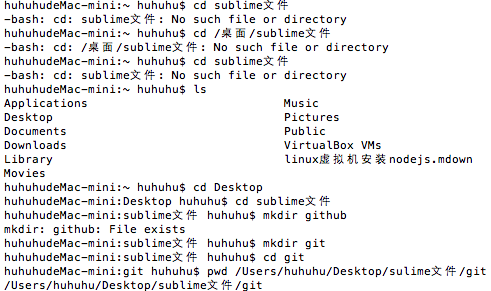
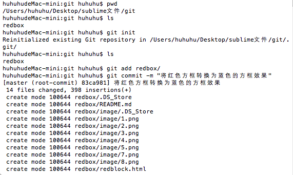

# github在mac上的安装和使用
一、首先打开终端(Terminal),输入"git"命令,弹出github的安装窗口选择安装,单击"继续"：


二、安装完成后再次输入"git"命令，跳出如下命令提示等内容表示github已经安装成功了；


三、然后需要设置如何上传文件或文件夹：
1.首先创建一个专属存放上传github文件的新文件夹，在终端输入命令:"mkdir git（新建文件夹名称）"，然后输入"cd git"，打开刚刚新建的文件夹，再次输入"pwd /Users/huhuhu/git（文件夹所在路径）"显示该文件夹当前的目录；


* 由于mac的系统权限限制，发现之前创建的新文件夹无法被查看，输入"cd"退出当前文件夹，再输入"ls"查看目前的主文件夹目录，发现新建的"git"文件没有建立在"Desktop"文件夹中(在mac系统中，由于权限原因所以只能查看到此文件夹中的内容)，然后输入"sudo rm -r -f git(文件夹名称)"进行删除文件夹操作，输入密码后再次输入"ls"命令，看到刚才新建的"git"文件夹已经被删除，


* 接下来使用"cd +文件夹路径"进入想要新建文件夹得位置，在重复上述新建文件夹的步骤，新建出"git"文件夹，

	* 在新建文件夹的过程中因为路径输入不正确(不完整)，所以出现了"-bash: cd: sublime文件: No such file or directory"(路径不存在或是相对路径而不是绝对路径)的错误提示，我采用的方法是逐步输入路径，首先输入"ls",然后"cd +Deskto"进入"Desktop文件夹",在使用同样的方法进入下一层文件夹路径，直到进入自己新建的"git"文件夹内，

	* 在建立新的文件夹时，由于新建文件夹名时再次出现"mkdir: github: File exists"(检查文件或目录是否存在)错误,提示我该文件夹名重复，于是重新更改文件夹名称即可解决问题；

* 和之前使用相同的方法进入新建的文件夹"git"



2.将需要上传的文件夹放入"git"文件夹中，并将需要显示的.md文件改名为"README.md"


3.根据github上传的指令提示，


4.输入初始的命令"git init"初始化现存的git仓库并且添加一个隐藏的".git"目录，然后尝试上传命令，输入"git add redbox(上传文件夹的名称)",
然后输入"git commit -m "对上传文件的描述"

* 出现了" Please tell me who you are."（未设置登入信息）错误提示，根据错误提示中的解决建议，在终端输入自己github账号的名称和邮箱

```
 git config --global user.email "you@example.com"
  git config --global user.name "Your Name"
```


* 然后尝试根据以上方法重新上传，根据终端的命令信息提示，表示该文件夹中的内容已经上传到了版本库中，但还未上传至github，



* 根据命令提示，由于首次登入github上传文件时，需要输入一下命令："git remote add origin + 你需要上传的github仓库位置"

* 接下来输入"git push -u origin master"命令，登入github，输入用户名及密码

	* 错误提示"error: failed to push some refs to 'https://github.com/hujinbei/Study.git' ",push上传错误后根据教程，输入"get pull origin master"命令后，


* 会出现"vim"编辑框(提交更改时显示)，然后需要"Esc"-->输入":+q+!"-->"Enter（回车）"，即可退出此编辑框，然后会自动更改提交的操作，如需再次打开vim，则在终端输入"vim"就可以打开了；

	* 之后产生的数据，就意味着将原有github仓库中的文件全部下载放入新建的"git"文件夹中，打开文件夹发现新增许多仓库中下载的文件夹；


* 更新数据操作完成后，再次输入"git push -u origin master"命令，就可以成功上传


