# 使用impress制作ppt
1、首先打开github主页，在"搜索"处输入"impress.js"，然后单击"impress/impress.js"打开，打开后单击页面右边的"clone or download"，单击下载"Download Zip",

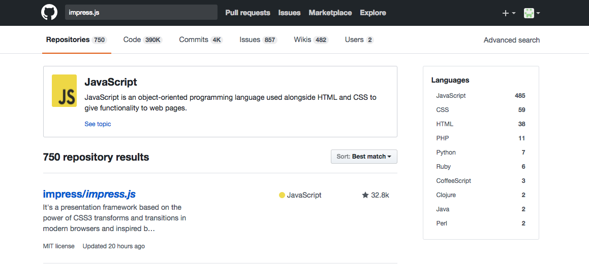

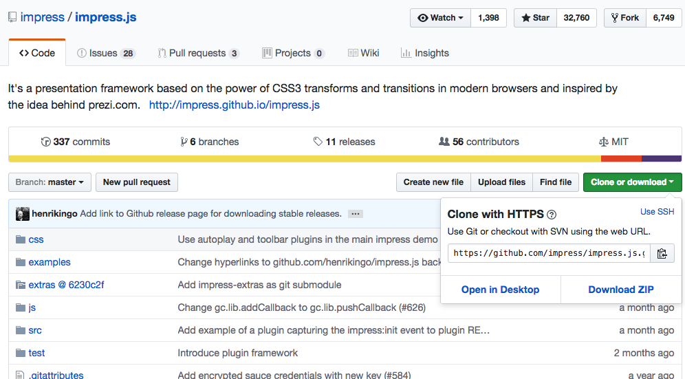

2、下载完成后打开.zip文件，使用sublime text打开"css"文件夹中的"impress-demo.css"，这个文件用于更改样式、字体、图片等元素的操作；

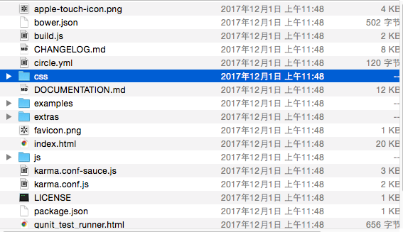

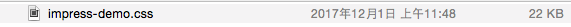

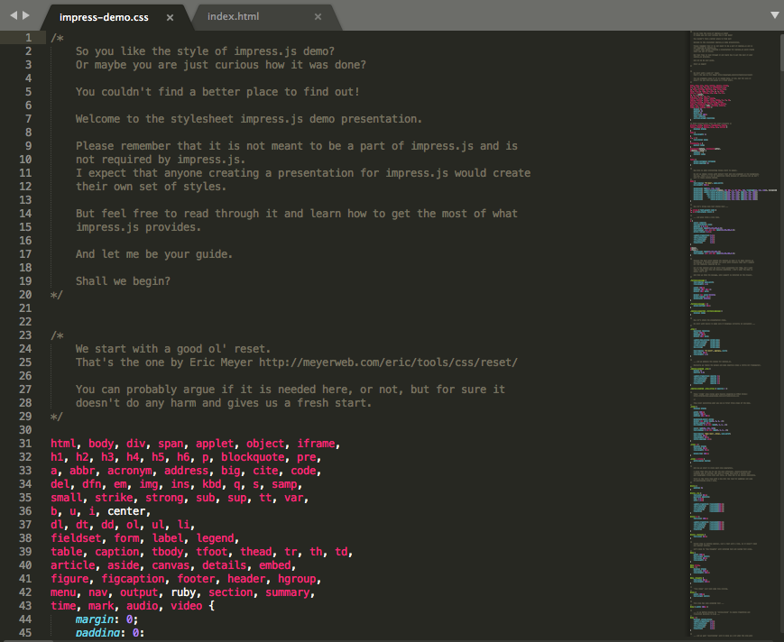

* 再打开.zip文件夹中的"Index.html"文件，内容如下图所示：

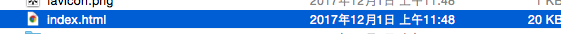

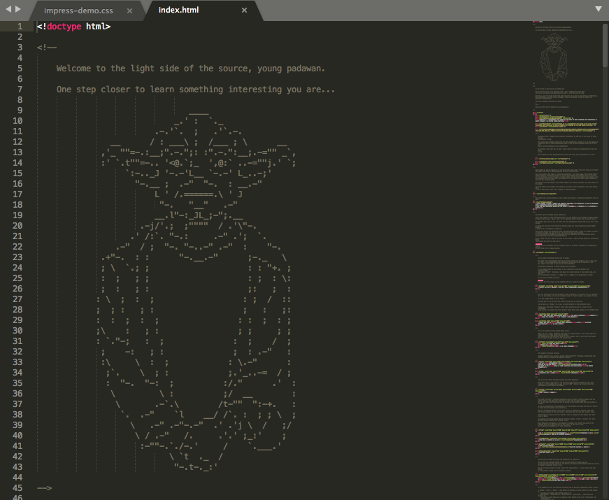

* 单击右键，然后"Open in Browser"打开文件，出现一个会自动翻页的PPT，之后的PPT的文字内容也是在这个页面中进行添加更改的

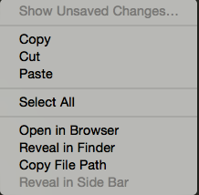

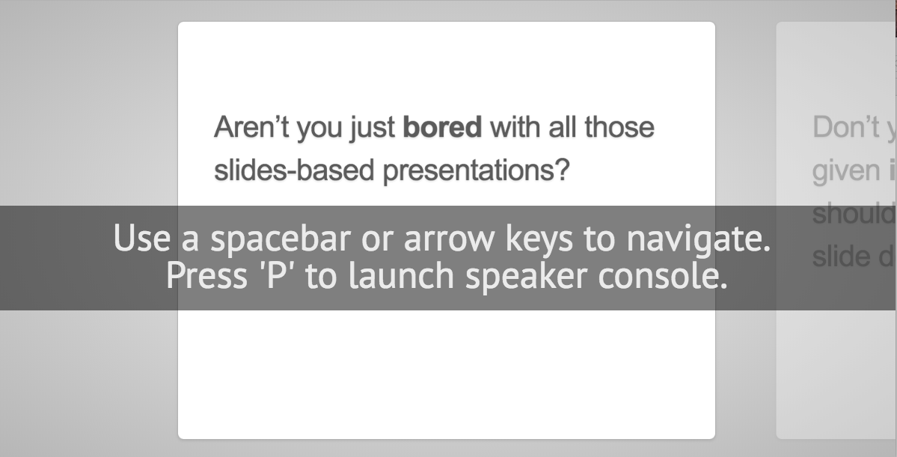

3、在对index.html文件编辑时最好保留最初的版式，以后出错时可以对照检查

* 我将原来的index.html文件另存为"index1.html",并在此文件中进行制作ppt

	* 删除.html文件中无用的注释后再进行编写

（1）这是第一张幻灯片的板式,可以根据自己想要的内容进行修改：

* 首先你需要建立一个< div>标签,这个< div>相当于是用来装你添加进PPT中内容的一个盒子，你添加的文字、图片等所有的内容都将在这个标签中添加并更改；其中"id"的值为幻灯片的名称，"class"的值是幻灯片的格式属性,"step slide"相当于普通幻灯片中的平铺效果

* 其次需要注意的是，对于"data-x"和"data-y"的值得设定，幻灯片的x、y坐标决定了幻灯片在页面中的位置，以及幻灯片之间的距离，当"data-x"和"data-y"的值都为0时，幻灯片将出现在页面的中间，根据自己想要的效果加以调整，若不同两张幻灯片的x值相同时，后面一张幻灯片将无法显示；

```javascript
<div id="bored" class="step slide" data-x="-1000" data-y="-1500">
	<!--data-x ：幻灯片的x坐标  data-y：幻灯片的y坐标-->
        <q>Aren’t you just <b>bored</b> with all those slides-based presentations?</q>  <!--幻灯片文本内容 -->
    </div>

<div class="hint">
    <p>Use a spacebar or arrow keys to navigate</p>
</div>	<!--幻灯片中的浮窗-->
```


4、 更改幻灯片的背景格式，需要在刚开始介绍的"impress-demo.css"文件中进行添加样式；

* 首先为自己添加的背景样式设置名称，这里我随便设置了一个名称为"p1"的样式，作为样式背景的图片只能保存在"impress.js-master"文件夹中的"images"文件夹下，然后输入"background-image:url(图片路径)"，保存impress-demo.css文件即可，如以下代码所示：

```css
.p1{
    background-image: url(../images/timg.jpeg);
}
```
* 然后直接在"class"中插入你设定好的样式名称，注意不可以删除文件中原有的格式和属性，否则可能导致文件结构不正确ppt无法显示

```javascript
<div id="bored" class="step slide p1" data-x="-1000" data-y="-1500">
        <q>Aren’t you just <b>bored</b> with all those slides-based presentations?</q> 
    </div>
```

更换后的效果如下图所示：

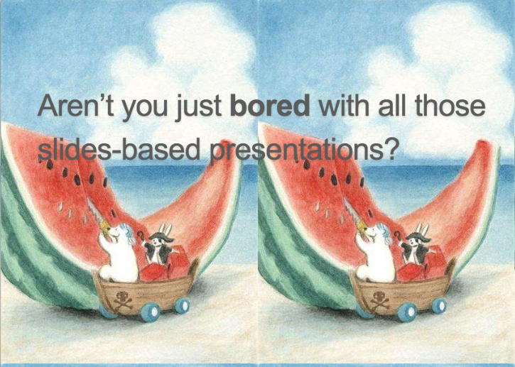

* 同时可以在< q>标签中设置属性为"居中"显示，并用< strong>标签加粗文本；

```javascript
 <div id="bored" class="step slide p1" data-x="-1000" data-y="-1500">

        <q style="text-align: center;" ><strong>第十六周工作报告</strong></q>	<!-- 在<q>标签中加入属性设置内容居中：style="text-align: center;" <strong>标签加粗文本-->
    </div>
```


5、在插入图片时，需要使用一个< img src="图片路径" width="500px"(宽) height="550px"(长)>标签来实现插入图片的操作，长、宽的数值根据图片的大小自己调整；

```javascript
     <div class="step slide p3" data-x="4000" data-y="-1500">
        <h1>代码如下：</h1><br>
     	<br>
        <h1>效果如图所示：</h1><br>
        <br>
        <h1>参考代码：</h1><br>
        <br>
        <h1>计算结果：</h1><br>
        
    </div>
```

* 插入图片后：

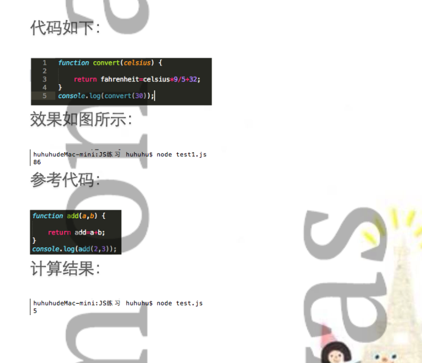

6、另一种幻灯片的播放形式是class="step",这种效果是去掉边框直接显示在页面背景上的，data-scale="4"是调整幻灯片缩放比例大小和旋转的功能，data-rotate="90"是设置3D幻灯片的旋转角度的值

```javascript
 <div id="title" class="step" data-x="0" data-y="0" data-rotate="90" data-scale="4">
        <span class="try">then you should try</span>
        <h1>impress.js<sup>*</sup></h1>
        <span class="footnote"><sup>*</sup> no rhyme intended</span>
    </div>
```

* 效果如图：

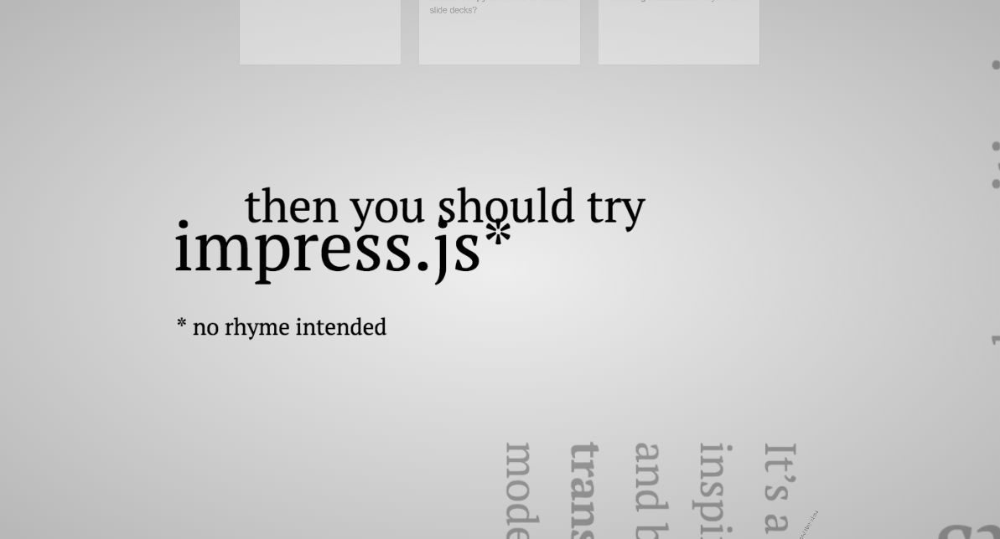

 7、插入超链接
 * 给文字插入超链接，只需要使用标签 < a href="网址">文字内容或网址名称< /a>即可，单击PPT中的白底文字就可以跳转到相应的网页；

```
<div id="its" class="step" data-x="850" data-y="3000" data-rotate="90" data-scale="5">
        <p>It’s a <strong>presentation tool</strong> <br/>
        inspired by the idea behind <a href="http://prezi.com">prezi.com</a> <br/>
        and based on the <strong>power of CSS3 transforms and transitions</strong> in modern browsers.</p>
    </div>
```
 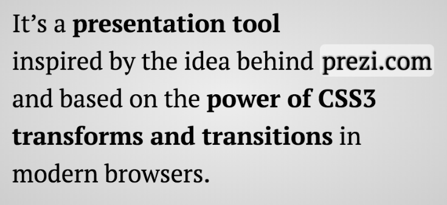

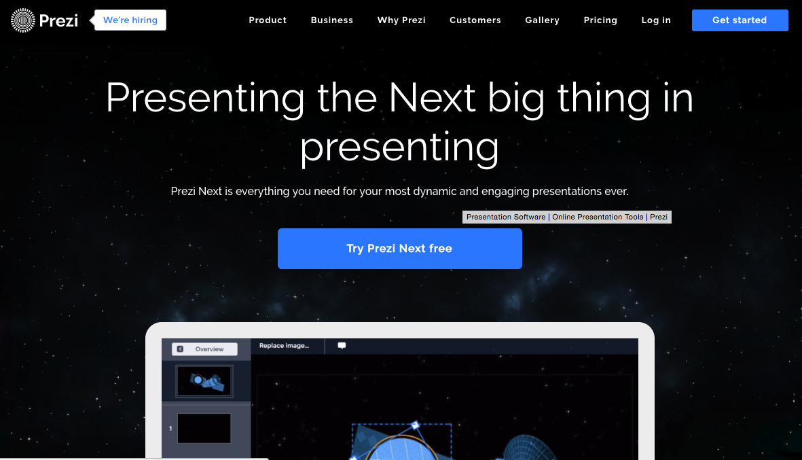

### 8、制作3D旋转PPT

* 首先，3D旋转ppt的坐标与平铺的PPT有所不同，多出了data-z="-100" data-rotate-x="-40" data-rotate-y="10"这三个标签，
	* data-z="-100" 是指幻灯片中的Z坐标；
	* data-rotate-x="-40" 是指x坐标的旋转角度；
	*  data-rotate-y="10" 是指y坐标的旋转角度；

```javascript
 <div id="its-in-3d" class="step" data-x="6200" data-y="4300" data-z="-100" data-rotate-x="-40" data-rotate-y="10" data-scale="2">
        <p><span class="have">have</span> <span class="you">you</span> <span class="noticed">noticed</span> <span class="its">it’s</span> <span class="in">in</span> <b>3D<sup>*</sup></b>?</p>
        <span class="footnote">* beat that, prezi ;)</span>
    </div>

```

效果如下：

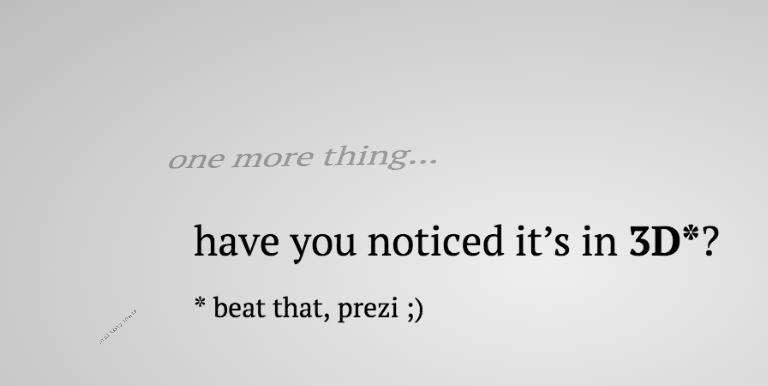


